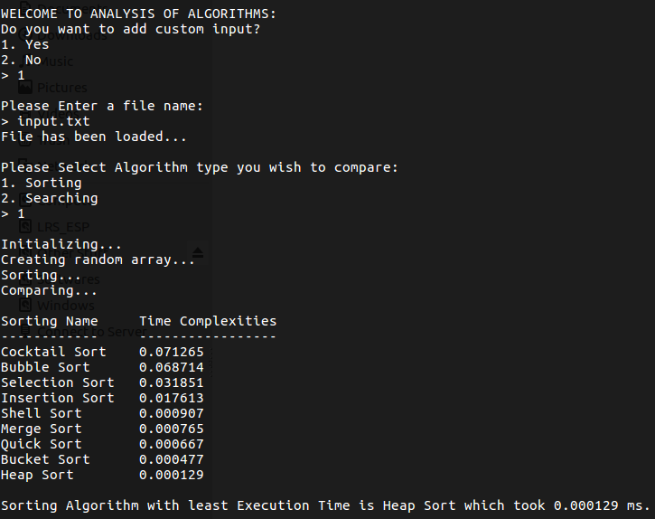
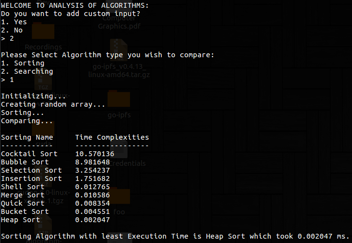
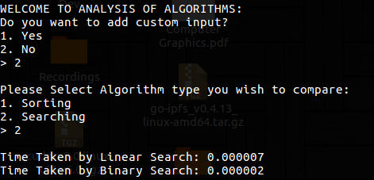

# Comparative Analysis Tool

This is an Analysis Tool for Algorithms in an attempt to create Minor-1 Project. The tool is based on Execution Time of different Algorithms based on the set of Algorithms user has selected. The tool is entirely written in C.

## Sorting Algorithms Implemented
- [Merge Sort](http://www.geeksforgeeks.org/merge-sort/)
- [Bubble Sort](http://www.geeksforgeeks.org/bubble-sort/)
- [Heap Sort](http://www.geeksforgeeks.org/heap-sort/)
- [Insertion Sort](http://www.geeksforgeeks.org/insertion-sort/)
- [Quick Sort](http://www.geeksforgeeks.org/quick-sort/)
- [Selection Sort](http://www.geeksforgeeks.org/selection-sort/)
- [Shell Sort](http://www.geeksforgeeks.org/shellsort/)
- [Cocktail Sort](http://www.geeksforgeeks.org/cocktail-sort/)
- [Bucket Sort](http://www.geeksforgeeks.org/bucket-sort-2/)

## Searching Algorithms Implemented
- [Linear Search](http://www.geeksforgeeks.org/linear-search/)
- [Binary Search](http://www.geeksforgeeks.org/binary-search/)
---

## Snapshots from the Tool 

### Sorting

### Searching

---

### Contributers
- Abhinav Sharma
- Aastha Rawat
- Hemant Thakkar
- Jyotsna Bisht

### License
Licensed under [MIT License](LICENSE)